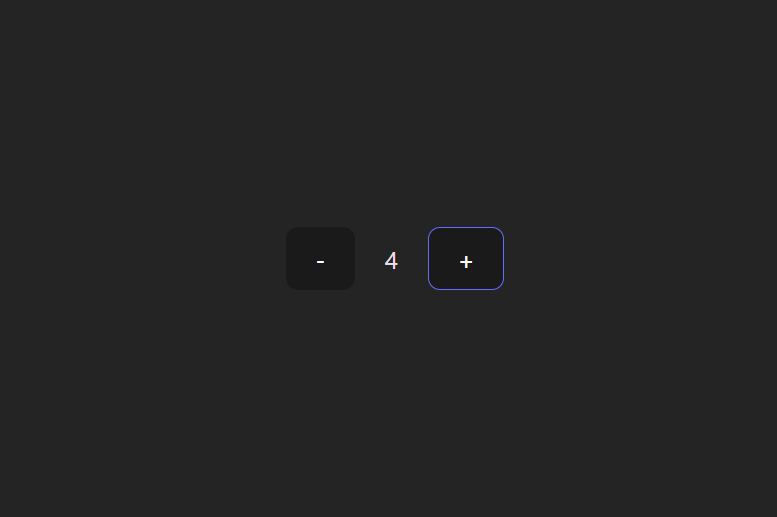

# Basic React Project

This project is for training only. This project uses basic React to make a simple counter using two button (minus) and (plus). The counter itself would not exceed -1 and 10.

## Preview



## How to Run this Project

1. Clone this project
```
git clone https://github.com/mdavindarinaldy/fgo24-react-basic.git
```
2. Install dependencies
```
npm install
``` 
3. Run the project
```
npm run dev
```
4. Project will running on http://localhost:5173

## Dependencies
This project using node.js to run, make sure to install node on your machine. Other than that, this project also using Vite, React and ESLint.

## Basic Information
This project is part of training in Kodacademy Bootcamp Batch 24 made by Muhammad Davinda Rinaldy
